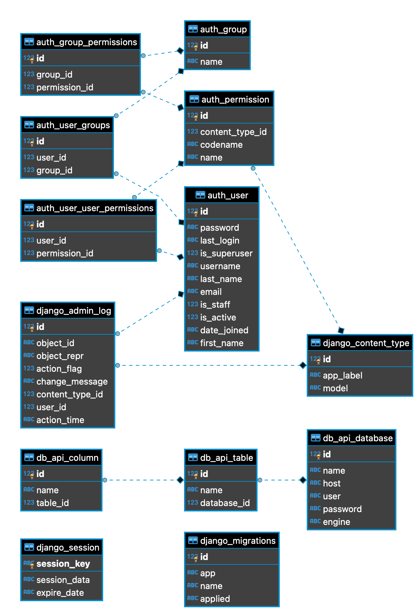

## Run the project
1. `cd db_extraction`
2. `docker-compose up`
3. `docker exec -it db_extraction_web_1 /bin/bash` in second terminal
4. `python manage.py migrate` inside docker container
5. reach app via `http://0.0.0.0:8000/api/`
6. tests can be run with `python manage.py test db_api` 

## A high-level system diagram 
   - A Web Server is in place to manage HTTP requests. It utilizes Django views for processing these requests, interacts with the database for data retrieval and storage, and subsequently dispatches responses.
   - The Database is the primary storage location for all data within the system.
   - The Django Backend is the core of the application's logic. This component is responsible for executing business logic, facilitating communication with the database, and delivering data through various API endpoints.
   - Docker is employed to encapsulate the application along with its dependencies, ensuring uniformity across different operating environments

## DB diagram

## API documentation
That was added as part of the comments to django views, but I can duplicate it here:

1. Operations on Database instances
   - List Databases: GET /api/databases/
   - Retrieve Database: GET /api/databases/{id}/
   - Create Database: POST /api/databases/
   - Update Database: PUT /api/databases/{id}/
   - Delete Database: DELETE /api/databases/{id}/`

2. Operations on Table instances
   - List Tables: GET /api/tables/
   - Retrieve Table: GET /api/tables/{id}/
   - Create Table: POST /api/tables/
   - Update Table: PUT /api/tables/{id}/
   - Delete Table: DELETE /api/tables/{id}/
   - Search Table: GET /api/tables/search_by_name/?name=nameToSearch

3. Operations on Column instances
   - List Columns: GET /api/columns/
   - Retrieve Column: GET /api/columns/{id}/
   - Create Column: POST /api/columns/
   - Update Column: PUT /api/columns/{id}/
   - Delete Column: DELETE /api/columns/{id}/

## Answers to the additional questions
1. ### How would you implement authentication? 
   By default Django is using session based authentication, but the best implementation would be to use a token based one. Also SAML can be used for some of the projects where we have few systems that are connected to each other. 

2. ### If you had to scale this system up to serve 1000s of requests per hour, how would you do it?
   - Implement caching for frequently accessed data to reduce database load.
   - Orchestration using docker + kubernetes in order to do a load balancing.
   - Async task distribution with FastAPI and async database drivers like `asyncpg` for PostgreSQL to manage high concurrency.
   - Use Gunicorn as a server, not the one I've used for dev env.

3. ### If you had to be able to support Databases with 10,000 tables, how would your design change? What if you had to support databases with a million columns across 100,000 tables?
   - Implement efficient indexing for databases with such a large number of tables and columns.
   - Implement sharding to distribute data across multiple databases, effectively managing the load and enhancing performance.
   - Focus on optimizing SQL queries for efficiency. This could involve rewriting queries for performance, using more efficient joins, limiting the data returned by queries, and employing database features.
   - Consideration of NoSQL databases for specific use cases (e.g. in scenarios where there is a need to manage semi-structured or unstructured data with high write-read loads)